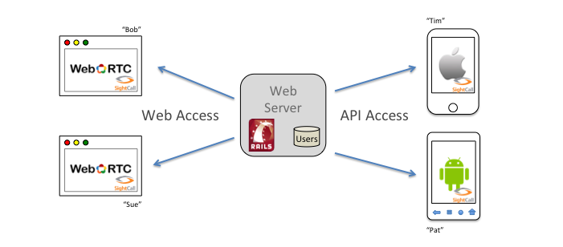

Build a Rails App using RTCC
================================================================

This repository hosts an example Rails project that illustrates how to
use RTCC to make and receive video calls with a web browser and
WebRTC.  You can simply check-out and run the example as is, but we
suggest using it as a reference as you follow the series of recipes.
If you follow the steps of these recipes, you should have a working
Rails site that is the same as the one checked in here.  In the
recipes, we'll give you some tests to run along the way to make sure
the project is working.  However, if you follow the steps and get
stuck, the reference code here can be used to get you back on track.

SightCall's real-time communication platform is built with a strong
foundation of "Identity."  Each endpoint in a RTCC system is
authenticated against an Identity Provider and is granted access to
RTC services with a secure token.  For this reason, this tutorial is
built using a little web-site that implements a Username/Password
authentication system to log-in each user.

In addition to using WebRTC in a browser, we are going to extend our
Rails application with an API for use by mobile clients.  The later
chapters in the tutorial describe how to build small RTCC video call
apps using this API.  The part of the tutorial regarding mobile
clients delves into the details of what a back-end service needs to
provide to a mobile client, and the steps a mobile client makes to
connect to the RTCC Cloud.  When done, you will be able to make and
receive video calls between WebRTC enabled browsers, and native apps
on IOS and Android.
    
## Prerequisites

You should have Rails4 installed and you will need a text editor.

You should also have requested a RTCC API Key.  If you have not
already, you should visit here: http://www.sightcall.com/developers/.

## Table Of Contents

#### [Part 0: Quickly Build and Run the Rails App](doc/HOWTO-part0.md)

You can completely skip the tutorial and simply configure and run the
rails app.  You can run it locally, or on Heroku.  Here's how.

#### [Part 1: Build a little Rails App with Login and Logout](doc/HOWTO-part1.md)

In [Part 1](doc/HOWTO-part1.md) we show you how to build an extremely
simple Rails app with Username/Password log-in and log-out
functionality.  This gives each user of the application an Identity.
The web site has only one main page, and implements a very basic log
in and log out mechanism.

The purpose of Part 1 is to provide a website framework in which to
embed RTCC functionality.  The RTCC platform relies-on and requires
notions of identity and authentication.  This little Rails framework
has just enough to provide a small database of users, each of whom can
log in and log out.  It is a mini Identity Provider.

If you already have a Rails site that you want to add RTCC
functionality too, then you can skip this part.

#### [Part 2: Integrate the RTCC Auth Client](doc/HOWTO-part2.md)

In [Part 2](doc/HOWTO-part2.md) we integrate the Ruby authentication
client from RTCC into our Rails server.   Authentication client
components are available here: https://github.com/sightcall/Authentication-Client.

The purpose of Part 2 is to show how an authenticated user on a web
site may be granted a token to use RTCC video services.  The RTCC
cloud differs from some other systems in how it verifies the identity
of endpoints and maintains the uniqueness of the Identity of each
endpoint.  This part of the tutorial helps to explain how that works.

#### [Part 3: RTCC Javascript and Video Calls](doc/HOWTO-part3.md)

In [Part 3](doc/HOWTO-part3.md) we include the RTCC Javascript on the
video-call page of our web site.  We show how to construct the
Javascript to initiate video calls, and we also show how to present a
pop-up to answer an incoming call.

At the end of Part 3, you will have a working web site in which
different users can log in and create video calls to one another by
clicking a button!

#### [Part 4: Adding an API](doc/HOWTO-part4.md)

In [Part 4](doc/HOWTO-part4.md) we extend the Rails application to
provide an API interface for mobile clients.  Mobile applications
written for iOS and Android that use the RTCC SDK can use these APIs
to connect to the Rails "mobile back-end" to get a token and to get
a list of friends to call.

#### [Part 5:  A Simple Android App](https://github.com/sightcall/tutorial-android-rtcc)

In a separate upcoming recipe,  we'll
show how to write a very simple Android App that can log in as one of
the users in the database and can call one of the other users in the
database.  The other user can be logged in on the Web site, on an IOS
device, or on another Android device.

