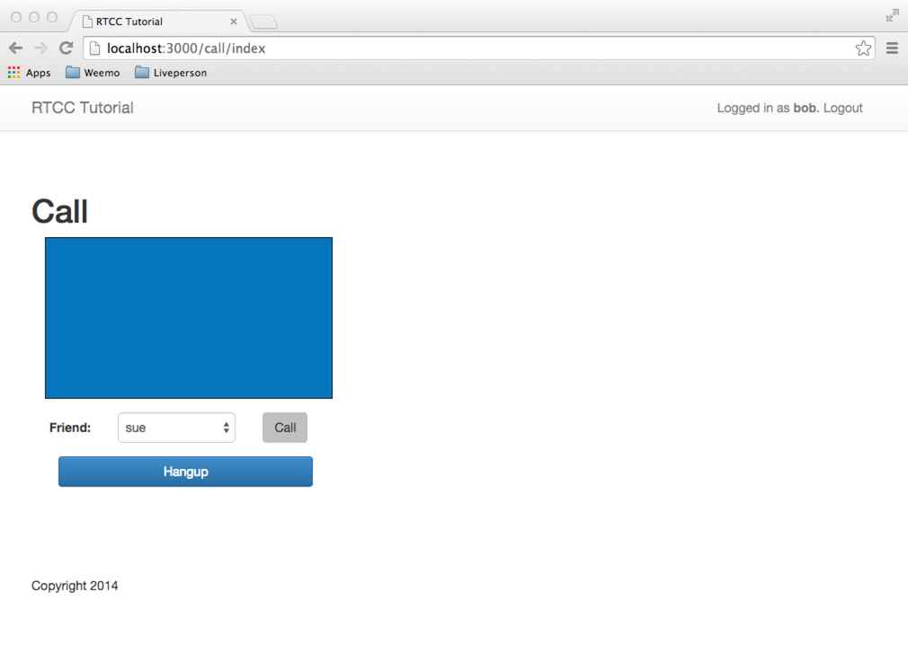
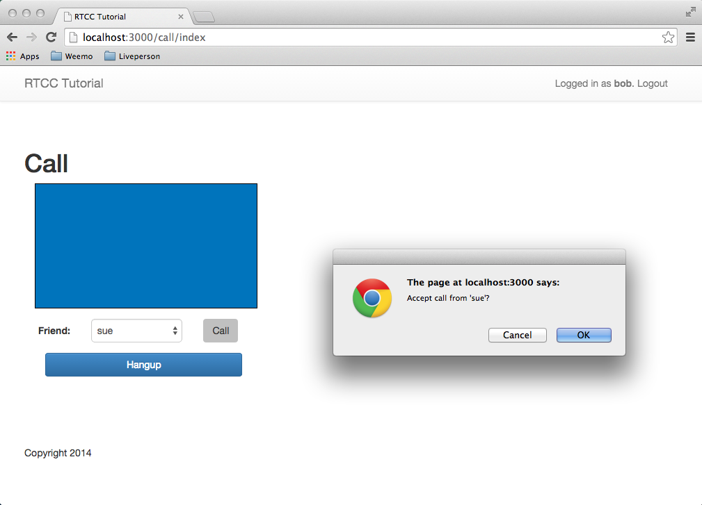
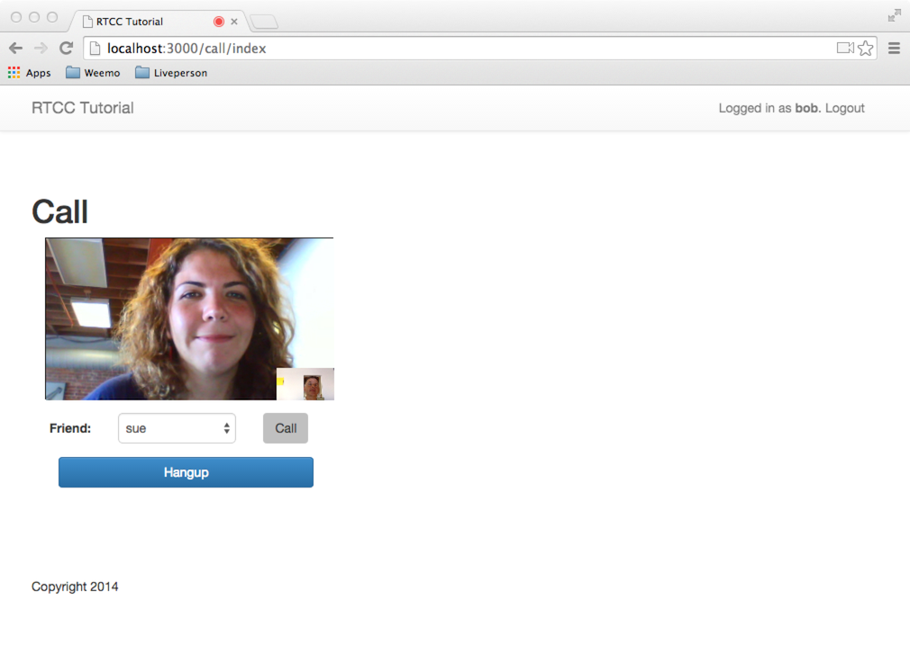

Part 3: RTCC Javascript and Video Calls
================================================================

In Part 2 of this series, we added the Ruby authentication client
to a Rails web site.  When we were done, the web site was able to
provide a RTCC authentication token for the current logged-in user.

In Part 3 of this series, we will add RTCC Javascript to a web page
and create a fully functional video call system.  By working through
this example you will learn about how to include the RTCC Javascript,
how to initialize the RTCC Javascript object, and how to make and
receive one-to-one Video calls using WebRTC.


Add the RTCC Javascript to your Site
----------------

Open the main template for your site and add a `<script>` tag to
load the RTCC Javascript.  You should place this tag in the
`<head>` section of your project.  


```html
app/views/layout/application.html.erb

<head>
  <title>My Project</title>
  <link rel="stylesheet" href="//maxcdn.bootstrapcdn.com/bootstrap/3.2.0/css/bootstrap.min.css" />
  <link rel="stylesheet" href="//maxcdn.bootstrapcdn.com/bootstrap/3.2.0/css/bootstrap-theme.min.css" />
  <script src="//download.rtccloud.net/js/webappid/<%= RTCC_APP_ID %>" ></script>
  <%= stylesheet_link_tag    "application", media: "all" %>
  <%= javascript_include_tag "application" %>
  <%= csrf_meta_tags %>
</head>
```

You'll notice that the particular script downloaded for your project
is tied to your RTCC AppID.  In the code above, we interpolated the
value of the global variable `RTCC_APP_ID` that you defined in
config/environment.rb earlier.


Define the Video Box
----------------

All of the action will take place in a single page of our web site.
On this page, first define an area to render the WebRTC
video window and to place its widgets.

In file app/views/call/index.html.erb, add a container and a
video-container like this.

```html
<h1>Call</h1>

<div class="container">
  <div class="row">
    <div class="col-sm-4">
      <div id="video-container" style="width:320px; height:180px; background:#0074bc; border: 1px solid black;">
      </div>
    </div>
  </div>
</div>

```

The ID of this element is "video-container" - we'll need this later
when we initialize the RTCC object.


Define a list of friends to call
----------------

Recall that the index method in our call_controller didn't do
anything.  Let's change that.  Open up
app/controllers/call_controller.rb and modify the index method to
compute a list of the friends a user might want to call.


```ruby
# app/controllers/call_controller.rb
  def index
    @me = current_user
    @friends = User.all.select{ |u| u != @me }
  end
```

Now our index method creates a list of all users in the system who are
not the current user (me).  We can use the list of friends in the view
we are working on.


Add a button to call a friend
----------------

Now go back to the index page and add a button and a drop-down select
list.  Beneath the video box, add the following code.


```html
# app/views/call/index.html.erb

<div class="container">
  <div class="form-horizontal">
    <div class="form-group"></div>
    <div class="form-group">
      <label class="col-sm-1 control-label">Friend:</label>
      <div class="col-sm-2">
        <%= select_tag(:friend, options_from_collection_for_select(@friends, 'rtcc_uid', 'name'), {id: "friend_select", class: "form-control"}) %>
      </div>
      <div class="col-sm-1">
        <button id="call_button" disabled class="btn btn-large" onclick="call()">Call</button>
      </div>
    </div>

    <div class="form-horizontal">
      <div class="col-sm-4">
        <button class="btn btn-large btn-primary btn-block" onclick="hangup()">Hangup</button>
      </div>
    </div>
  </div>
</div>

```

The `select_tag` uses the list in the instance variables `@friends`
and generates a drop-down select list.  In short, this line says:
generate a select tag with a Javascript name of 'friend`, populating
it with the 'rtcc_uid' and 'name' fields of the list of objects in the
instance variable `@friends`.

The next control is a simple button that invokes the `call()` function
when pressed.  The `call()` function looks at the UID of the currently
selected friend and creates a call to them.

The Hangup button will hang up the current call.  We'll implement that
soon too.


Test Your Work
----------------

At this point it is a good idea to start up your Rails server and test
it out.

```shell
$ bin/rails server
```

You can see your website at
[http://localhost:3000/](http://localhost:3000/).  Login if you are
not already, and view the page.  You should see something like the
image below.  The video box will be there as will be the buttons for
your friends.  Next, we'll add functionality using Javascript.



Write the Javascript Code
----------------

We are going to add a big block of Javascript code into the page.
Add this after the video box and the buttons we defined earlier.
We'll describe what each of the pieces are doing here and how the
whole application fits tother.

The first three lines define some page-global variables.  The var `rtccAppId`
is taken from the Rails global variables you defined in
config/environment.rb.  Here we render it into the page and assign it
to a Javascript Variable.  Variables `rtcc` and `rtccCall` will hold
references to the main RTCC object, and to the current call.

The `initializeRtccApp` function will set some options and callbacks
before initializing the RTCC session.  It's fairly complicated.


```javascript
<script>
 var rtccAppId = "<%= RTCC_APP_ID %>";
 var rtcc = null;
 var rtccCall = null;

 function initializeRtccApp(rtccAppId, token, displayName) {
   var options = {
     debugLevel: 11,
     displayName: displayName,
     container: 'video-container'
     
   };
   rtcc = new Weemo(rtccAppId, token, 'internal', options);

   // Get the Connection Handler callback when the JavaScript is connected to WeempoDriver
   rtcc.onConnectionHandler = function(message, code) {
     console.log(['onConnectionHandler', message, code]);
     switch(message) {
       // Authenticate
       case 'connectedWeemoDriver':
         rtcc.authenticate();
         break; 
       case 'connectedWebRTC':
         rtcc.authenticate();
         break; 
       case 'sipOk':
         $("#call_button").removeAttr("disabled");
         break;
       case 'sipNok':
         break;
       case 'loggedasotheruser':
         rtcc.authenticate(1);
         break;
     }
   }
     
   rtcc.onCallHandler = function(call, args) {
     console.log(['onCallHandler', call, args]);
     rtccCall = call;

     // Handle incoming call
     if (args.type == 'webRTCcall' && args.status == 'incoming') {
       var ans = confirm("Accept call from '" + call.dn + "'?");
       if (ans == true) {
         rtccCall.accept();
       }
       else {
         rtccCall.hangup();
       }
     }

     // Handle refused call
     if (args.status == 'terminated' && args.reason == 'rejected') {
       alert("Call rejected");
     }

     // Handle call to UID not logged-in
     if (args.status == 'terminated' && args.reason == 'not found') {
       alert("User not logged in");
     }
   }

   rtcc.onGetHandler = function(name, value) {
     console.log(['onGetHandler', name, value]);
   }

   rtcc.onWeemoDriverNotStarted = function(downloadUrl) {
     var answer = confirm('Click OK to download and install the RTCC Client.');
     if (answer == true) {
       window.location = downloadUrl;
     }
   };

   rtcc.initialize();
 }

 function callFriend(friendUid) {
   rtcc.createCall(friendUid, 'internal', "<%= current_user.name %>");
 }

 function call() {
   var friendUid = $("#friend_select").val()
   console.log(["call", friendUid]);
   rtcc.createCall(friendUid, 'internal', "<%= current_user.name %>");
 }
   

 function hangup() {
   rtccCall.hangup();
 }

 function documentReady() {

   $.ajax({
     type: "POST",
     url: "/rtcc/callback",
     cache: false,
     dataType: "JSON"
   }).success(function(data) {
     console.log(["RtccToken Success", data]);
     var token = data.token;
     initializeRtccApp(rtccAppId, token, "<%= current_user.name %>");
   }).error(function(e) {
     console.log(["RtccToken error", e]);
   });
 }

 $(document).ready(documentReady);

</script>
```


#### The initializeRtccApp function

The arguments to this function are the AppID, a user token and the
display name of the current user.  These will be used to initialize
the global RTCC object.

The options array sets a wide variety of parameters for the RTCC
session.  The main item of interest here is the container parameter.
This gives the ID of the DOM element that will hold the RTCC video
box.

Next, we initialize the global RTCC object.

```
   rtcc = new Weemo(rtccAppId, token, 'internal', options);
```

This statement allocates data structures and sets up some state.  The
main purpose of this statement is to allocate us an object on which to
assign callback handlers that will customize the RTCC experience.
There are many callback handlers, with many options.  In this
tutorial, we are showing how to define a minimal application, so we
only register for a few callbacks and only notice a few event types.

##### The onConnectionHandler

The onConnectionHandler callback indicates various events in the
lifetime of an internet connection from the browser to the RTCC
Core.  What we've shown here is boilerplate for most minimal
installations.  Upon the 'connectedWebRTC' or 'connectedWeemoDriver'
event, we kick off the next phase of initialization by calling
`rtcc.authenticate()`.

##### The onCallHandler

The onCallHandler callback is called in many different contexts to
indicate many changes in the state of a video call.  Its two arguments
are a `call` object, and an `args` object.  In our handler, we
set assign the global `rtccCall` to the current call object.

In this simple tutorial we are only implementing two behaviors.  When
we receive an incoming WebRTC call we present the user a confirmation
box asking them if they want to accept the call or not.  If they
confirm the choice we accept the call with `rtccCall.accept()`,
if not, we terminate the call with `rtccCall.hangup()`.

The other behavior that this callback defines is what we do if the
user at the remote end rejects our call.  We can examine the
`args` object for the reason a call was terminated.  If it was
rejected we pop up a Javascript alert saying so.


After the RTCC object has been initialized and we have attached
callback handlers, we can finally call `initialize()` to kick off the
RTCC session.  It is this method call that causes the RTCC
Javascript to launch an internet connection to RTCC and to register
the browser as an endpoint on the global RTCC network.


#### The rest of the Javascript

The `callFriend` and `hangup` functions are simple.  The `callFriend`
function takes the UID of another user and launches a new video
call directed to that UID.  The `hangup` function simply calls `hangup` on the
current call.

We define a `documentReady` function that is called when the entire
page has loaded.  This function launches the AJAX call that grabs a
token from the Rails server for the current logged-in user.  Once we
have the token, the `initializeRtccApp` function is called with the
`rtccAppId` and name of the current user.


## Try it out!

To test the web site you'll need two computers.  Open up our demo web
site on both computers and log in as 'bob' on one computer and 'sue'
on the other.

On the 'sue' computer click the 'bob' button.  A dialog box will pop
up on Bob's page asking if he will accept the call from Sue.  Click
"OK".



After the incoming call is accepted, the video call will be set up
between the two browsers and Sue will be chatting with Bob.





## What we have learned

In Part 3 of this tutorial series we showed how to integrate the RTCC
Javascript into a web page.  We showed how to include the Javascript
directly from the RTCC CDN (content-delivery network) using the
AppID.  We showed how to define an HTML div for holding the RTCC
video call and we showed how to tell the RTCC javascript the name of
the DOM element for holding the video.

This lesson showed how to initialize the RTCC Javascript object and
how to register event listeners for receiving and accepting a call,
and also how to reject an incoming request for a video call.  We
showed how to initiate a call to another authenticated RTCC user and
also showed how to present a pop-up box if the remote user rejects the
request for a video call.


<hr>

[ Back to [Part 2](HOWTO-part2.md) | Continue to [Part 4](HOWTO-part4.md) ]
